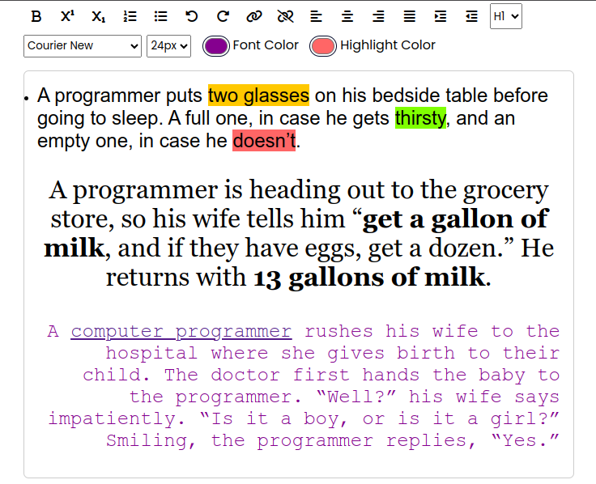

# Rich Text Editor
A simple rich text editor that enables users to create, edit, and format text documents with various styling options such as bold, font size, color, and alignment. Supports basic text manipulation functionalities like and undo/redo and creation of links. Users can switch between different text styles and formats.

# Project Image

