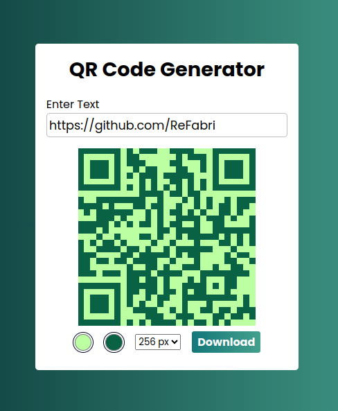

# QR Code Generator
A QR Code generator app to convert text input into QR codes, offering customization options such as selecting from preset sizes like 128x128, 256x256, and 512x512 pixels. Additionally, users can personalize the QR code appearance by choosing from a range of colors to match their preferences.

The user inputs their desired text, adjust size and colors, preview the generated QR code, and can download it for immediate use.

## Project Image

