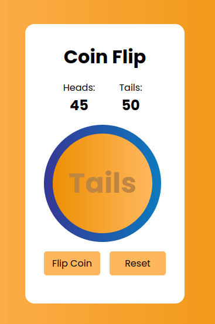

# Coinflip
The Coinflip app provides users with a simple way to simulate flipping a coin, allowing them to click a button to generate a random outcome of either heads or tails. The app keeps track of the number of heads and tails flipped, displaying the counts. Additionally, users have the option to reset the counts to start again by clicking the reset button.

## Project Image

