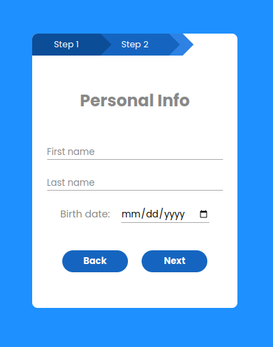

# MultiStepForm
An example of a multi step form that slides the previous form away to show the current form, also have a sliding marker on top for the user to know what is the current form name.

## Project Image

