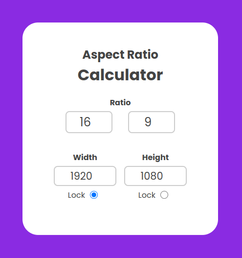

# Aspect Ratio Calculator
An Aspect Ratio Calculator that is useful to adjust screen dimensions based on specified aspect ratios and pixel sizes. Featuring input fields for aspect ratio (width and height in proportions) and screen size (width and height in pixels), the calculator dynamically adjusts the remaining parameters as users modify any of the unlocked values.

## Project Image

