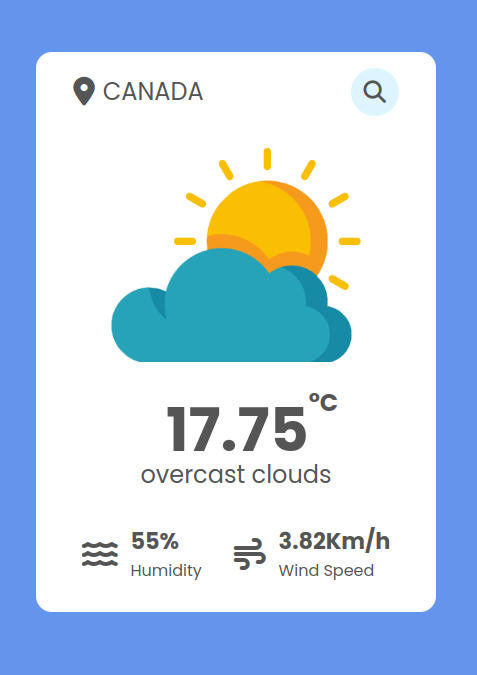

# Weather App
The Weather app provides users with real-time weather information based on their input location. Upon receiving user input, the app verifies if the input matches a location and retrieves the current weather data, including temperature, wind speed, humidity, and a corresponding image representing the current weather conditions.

## Project Image

