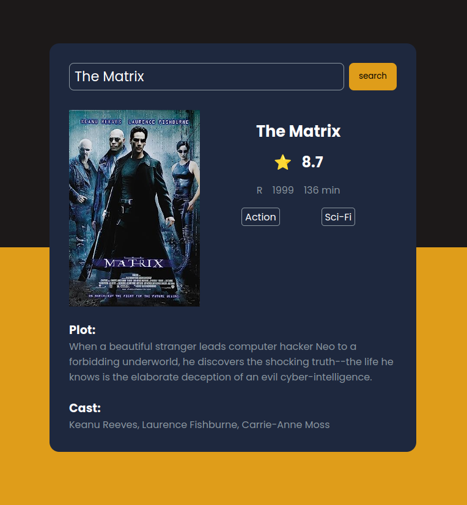

# Movie Guide
The Movie Guide app fetches data from an API with a comprehensive database of movies, allowing users to search for specific titles and access detailed information about them. Upon receiving user input, the app searches the database and displays relevant details if the movie is found, including the movie's title, release date, rating, duration, ESRB rating (if applicable), plot synopsis, movie poster, and cast members.

## Project Image

