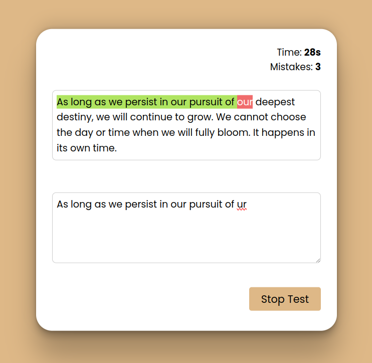

# Typing App
The Typing Challenge app allows users to enhance their typing skills. When the user clicks start, the app generates a random paragraph, prompting the user to type it accurately. As the user types, the app tracks the time taken and the number of mistakes made. Upon completing the paragraph, the app evaluates the accuracy of the user's typing and calculates the words per minute (WPM) based on the time taken and the length of the paragraph.

## Project Image

