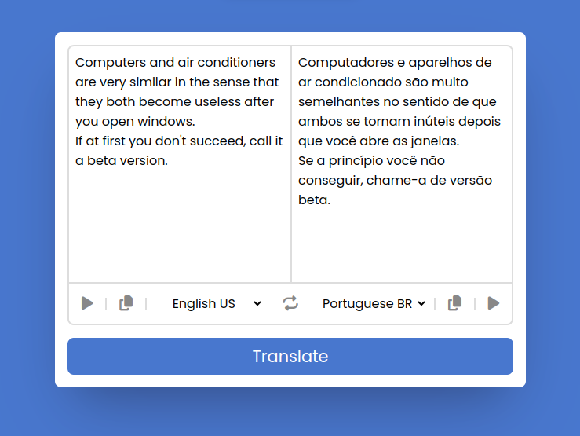

# Translator App
The Translator app offers users a tool for translating text between different languages. Users can input text in one language and receive translations into their desired target language. The app supports a wide range of languages, ensuring comprehensive coverage for users' translation needs. Additionally, users can convert the translated text into speech to listen the translation in the correct language.

## Project Image

