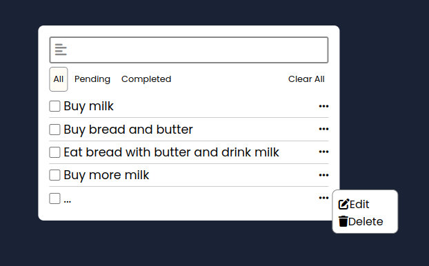

# Todo App
The Todo List app allows users to manage their tasks efficiently. Users can add new tasks, mark them as completed, and organize them using filters to view all tasks, pending tasks, or completed tasks. Additionally, the app features a clear all tasks button for users to easily reset their task list. A pop-up menu allows users to edit or delete individual tasks.

## Project Image

