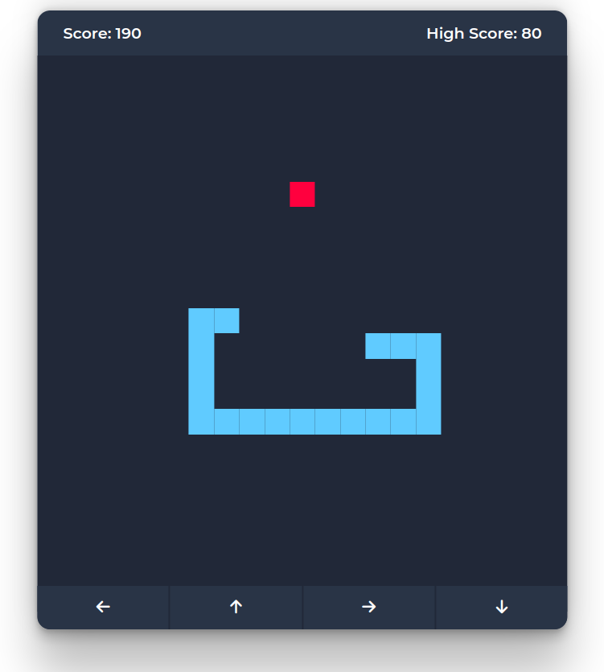

# Snake Game
The Snake Game allows the user to control a snake that must eat food and avoid obstacles. Users can navigate the snake using either the keyboard arrow keys or on-screen buttons for up, down, left, and right directions. As the snake consumes food, it grows longer, increasing the challenge of maneuvering without colliding with the walls or itself. If the snake collides with the outer walls or itself, the game ends, and the user's score is displayed. Additionally, if the score surpasses the previous high score, it is updated and stored as the new high score.

## Project Image

2
