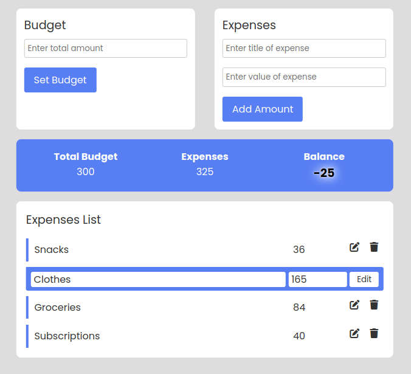

# Budget App
The Budget App allows users to set a budget and track their expenses. Users can input their budget value, which is stored within the app, and then add individual expenses with names and values. The app dynamically calculates and displays the total expenses and current balance. Additionally, users can edit the names and values of individual expenses, with changes instantly reflected in the expenses and balance counters.

## Project Image

2
